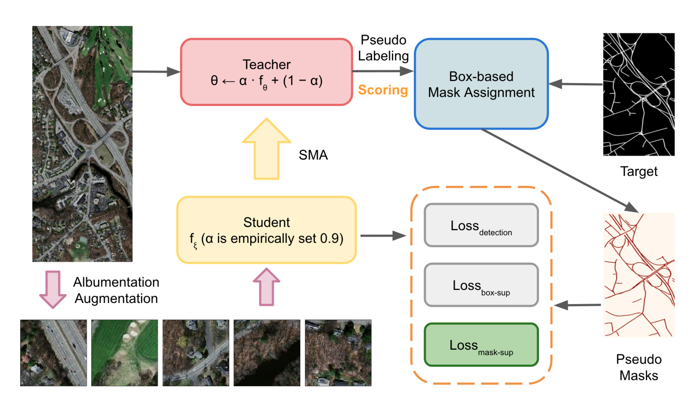

# 🚧 **GuidedBox: A Segmentation-Guided Box Teacher-Student Approach for Weakly Supervised Road Segmentation**

[](LICENSE)
[](https://kaopanboonyuen.github.io/GuidedBox)
[](https://www.tandfonline.com/toc/tres20/current)

Welcome to the official repository for **GuidedBox**, an innovative approach for enhancing weakly supervised road segmentation using a teacher-student framework. This repository provides the code and resources to replicate our results and explore the capabilities of GuidedBox.



## 📝 **Abstract**

Road segmentation in remote sensing is crucial for various applications such as urban planning, traffic monitoring, and autonomous driving. However, manually creating pixel-wise segmentation labels is a time-consuming task. To address this, **GuidedBox** proposes a novel weakly supervised approach that leverages segmentation-guided box annotations. Using a teacher model to generate precise pseudo masks, our framework dynamically evaluates and optimizes the learning process to improve segmentation quality.

Key features of **GuidedBox**:
- **Teacher-Student Framework**: A segmentation-guided box teacher model generates high-quality pseudo masks.
- **Noise-Aware Learning**: A mask-aware confidence scoring mechanism filters out low-quality masks to enhance learning.
- **State-of-the-Art Performance**: Achieved an AP50 score of **0.9231** on the Massachusetts Roads Dataset, outperforming existing methods such as SOLOv2, CondInst, and Mask R-CNN.

## 👥 **Author**

- **Teerapong Panboonyuen (Kao Panboonyuen)**  
  Laboratory of Mapping and Positioning from Space (MAPS) Technology Research Center,  
  Department of Survey Engineering, Faculty of Engineering, Chulalongkorn University

## 📊 **Results and Achievements**

- Achieved a **0.9231 AP50** score on the Massachusetts Roads Dataset with Swin-Base-FPN.
- Outperformed state-of-the-art methods like SOLOv2, CondInst, and Mask R-CNN in weakly supervised settings.

## 🚀 **Quick Start**

### **Requirements**

- Python 3.8+
- PyTorch 1.8+
- CUDA 11.1+
- Other dependencies listed in `requirements.txt`

### **Installation**

1. **Clone the Repository:**
   ```bash
   git clone https://github.com/kaopanboonyuen/GuidedBox.git
   cd GuidedBox
   ```

2. **Set Up a Virtual Environment:**
   ```bash
   python3 -m venv guidedbox-env
   source guidedbox-env/bin/activate  # For Windows: `guidedbox-env\Scripts\activate`
   ```

3. **Install Dependencies:**
   ```bash
   pip install -r requirements.txt
   ```

4. **Download the Dataset:**
   - **Massachusetts Roads Dataset:** [Download here](https://www.cs.toronto.edu/~vmnih/data/) and place it in the `data/` directory.

## 📈 **How to Use**

1. **Train the Model:**
   ```bash
   python train.py --config configs/guidedbox_config.yaml
   ```

2. **Evaluate the Model:**
   ```bash
   python evaluate.py --checkpoint checkpoints/guidedbox_best_model.pth --data data/test/
   ```

3. **Run Inference:**
   ```bash
   python inference.py --image_path images/sample.jpg --output_dir results/
   ```

## 🌍 **Live Demo**

Try out the live demo: [GuidedBox Demo](https://kaopanboonyuen.github.io/GuidedBox)

## 📂 **Datasets**

- **Public Dataset:** [Massachusetts Roads Dataset](https://www.cs.toronto.edu/~vmnih/data/)

## 🔍 **Citations**

If you find **GuidedBox** helpful in your research, please consider citing:

### **BibTeX for GuidedBox**
```bibtex
@article{panboonyuen2024guidedbox,
  title={GuidedBox: A segmentation-guided box teacher-student approach for weakly supervised road segmentation},
  author={Panboonyuen, Teerapong},
  journal={European Journal of Remote Sensing},
  year={2024}
}
```

### **BibTeX for Dataset**
```bibtex
@phdthesis{MnihThesis,
    author = {Volodymyr Mnih},
    title = {Machine Learning for Aerial Image Labeling},
    school = {University of Toronto},
    year = {2013}
}
```

## 📜 **License**

This project is licensed under the MIT License. See the [LICENSE](LICENSE) file for details.

## 📧 **Contact**

For questions or collaborations, please reach out:

- **Teerapong Panboonyuen**  
  - [Website: https://kaopanboonyuen.github.io](https://kaopanboonyuen.github.io)  
  - [Email: panboonyuen.kao@gmail.com](mailto:panboonyuen.kao@gmail.com)